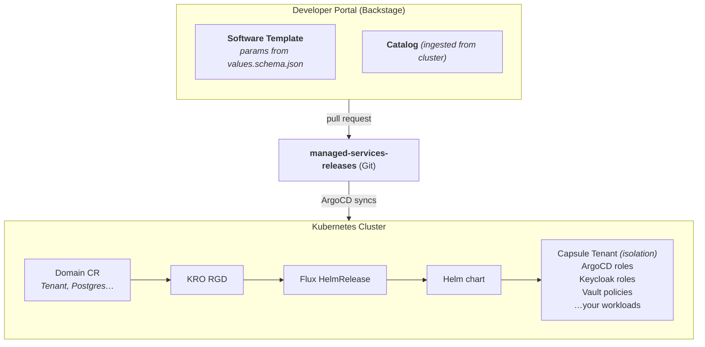
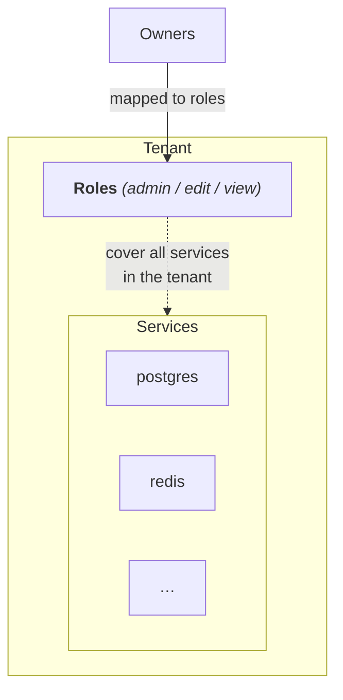
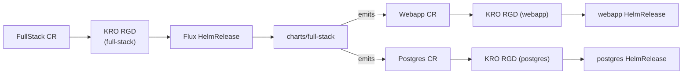

# Managed Services Framework

A self-service platform for running multi-tenant managed services on Kubernetes. Developers create services from a Backstage form; GitOps takes care of the rest.

> **One schema per service.** `values.schema.json` drives the Helm chart, the KRO-generated Kubernetes API, and the Backstage form — no duplication.

## How it works

Two repos, two roles:

- **This repo (`managed-services`)** — the *platform*: Helm charts, KRO definitions, Backstage templates, scaffolder. Rarely changes per tenant.
- **`managed-services-releases`** — the *state*: one manifest per live tenant or service. Backstage PRs land here; ArgoCD reconciles from here.

And three layers inside the cluster:

1. **Domain CR** (`Tenant`, `Postgres`, …) — what users create. Shape defined by `values.schema.json`.
2. **KRO ResourceGraphDefinition** — watches the CR and emits a Flux `HelmRelease`.
3. **Helm chart** — renders the actual Kubernetes resources.

## Diagram



## Tenancy model

A **tenant** is the unit of isolation and identity. Every service lives inside exactly one tenant.

The tenant owns the identity: owners, roles, and permissions are defined once at the tenant level. Service instances inherit them — they don't define their own.



## Backstage plugins

All four live in [TheCodingSheikh/backstage-plugins](https://github.com/TheCodingSheikh/backstage-plugins) and are required:

| Plugin | Role |
|---|---|
| [`scaffolder-field-validator`](https://github.com/TheCodingSheikh/backstage-plugins/tree/main/plugins/scaffolder-field-validator) | Validates form fields against a backend API before submission (e.g. *"tenant name already in use"*). Used via `ui:field: ScaffolderFieldValidator` in templates. |
| [`entity-scaffolder`](https://github.com/TheCodingSheikh/backstage-plugins/tree/main/plugins/entity-scaffolder/entity-scaffolder) | Embeds the scaffolder workflow inside an entity page so a CR can be edited with the same form that created it. Activated by the `backstage.io/scaffolder-template` + `last-applied-configuration` annotations we emit on every CR. |
| [`multi-owner`](https://github.com/TheCodingSheikh/backstage-plugins/tree/main/plugins/multi-owner/multi-owner) + [`…-multi-owner-processor`](https://github.com/TheCodingSheikh/backstage-plugins/tree/main/plugins/multi-owner/catalog-backend-module-multi-owner-processor) | Lets an entity have several owners, each with a role. Backend processor turns `spec.owners` into proper `ownedBy`/`ownerOf` relations; frontend card displays them. This is what makes the `owners` array meaningful in the catalog. |
| [`catalog-backend-module-kubernetes`](https://github.com/TheCodingSheikh/backstage-plugins/tree/main/plugins/catalog-backend-module-kubernetes) | Ingests Kubernetes CRs as Backstage entities (Components, Systems). The `lab.backstage.io/*` annotations on our skeleton manifests tell it what to create. |

## Project layout

```
managed-services/
├── argocd/                # ArgoCD bootstrap
│   └── applicationset.yaml #   Generates one Application per manifest in the releases repo
├── charts/                # Helm charts
│   ├── lib/               #   Shared helpers (labels, argocd + keycloak RBAC)
│   └── tenant/            #   The only hand-written chart today
├── definitions/           # KRO ResourceGraphDefinitions (auto-generated)
│   ├── gitrepository.yaml #   Flux source pointing at this repo
│   └── tenant.yaml        #   Regenerate with `make regen-defs`
├── software-templates/
│   ├── shared/            #   Shared parameters + steps used by every template
│   └── tenant/            #   Tenant template (special: no owning tenant to fetch)
├── scripts/
│   └── generate.py        # Scaffolds a new service
└── Makefile
```

## Commands

```bash
make new SERVICE=postgres   # Scaffold a new service (chart + RGD + template)
make regen-defs             # Regenerate every definitions/*.yaml from its chart
make lint                   # helm lint every chart
make template               # helm template (dry-run render) every chart
make validate               # Validate values.yaml against values.schema.json
make all                    # lint + validate
```

## Adding a new service

```bash
make new SERVICE=postgres
```

This writes:
- `charts/postgres/` — chart skeleton (depends on `lib`)
- `definitions/postgres.yaml` — the RGD
- `software-templates/postgres/` — Backstage template + skeleton, registered in `all.yaml`

Naming: `postgres` → `Postgres`, `full-stack` → `FullStack`. Kebab-case input, PascalCase Kubernetes kind.

Then customize four files in sync:

| File | Add |
|---|---|
| `charts/postgres/values.schema.json` | Properties for `spec.values` |
| `charts/postgres/templates/` | Kubernetes resources that consume those values |
| `software-templates/postgres/template.yaml` | Form parameters matching the schema |
| `software-templates/postgres/skeleton/manifest.yaml` | Map form input → CR body |

## Composing services

A *composite* service (e.g. `full-stack` = webapp + postgres) is just another managed service whose chart emits **child Domain CRs** instead of low-level Kubernetes resources. Each child has its own KRO RGD that takes over from there, so the composite chart never touches Deployments, StatefulSets, Services, etc. directly.



### Recipe

1. **Scaffold** — `make new SERVICE=<name>`. Treat it like any other service.
2. **Schema (`charts/<name>/values.schema.json`)** — embed each child's schema under a named key. Mirror the child's `values.schema.json` exactly under that key; only the top-level `tenant`/`name` are stripped (those come from the parent). Example:
   ```json
   {
     "type": "object",
     "required": ["tenant", "name", "webapp"],
     "properties": {
       "tenant": { "type": "string" },
       "name":   { "type": "string" },
       "webapp":   { "type": "object", "properties": { "image": {...}, "replicas": {...} } },
       "postgres": { "type": "object", "properties": { "version": {...}, "backups": {...} } }
     }
   }
   ```
   - **Don't `$ref` the children's schemas** — values.schema.json is consumed by Helm + Backstage offline; copy the relevant subtree (or the whole thing) under the child's key.
   - **Required at the parent**: only fields that *must* be supplied at composition time. Optional sub-objects should default to `{}` so children's own defaults apply.
   - **Naming**: pick keys that match the child's chart name (`webapp`, `postgres`) so the chart template reads naturally.

3. **Defaults (`charts/<name>/values.yaml`)** — provide a sensible default for every nested field. The form will use these.

4. **Chart templates (`charts/<name>/templates/*.yaml`)** — emit one child CR per file. Append a role suffix directly to `lib.fullname` so siblings don't collide:
   ```yaml
   apiVersion: managedservices.thecodingsheikh.io/v1alpha1
   kind: Webapp
   metadata:
     name: {{ include "lib.fullname" . }}-app
   spec:
     values:
       tenant: {{ .Values.tenant | quote }}
       name: {{ .Values.name }}-app
       # passthrough — every child key from values.schema.json
       image: {{ .Values.webapp.image | quote }}
       replicas: {{ .Values.webapp.replicas }}
   ```
   Two rules:
   - **One file per child** — keeps the dependency graph readable.
   - **Don't add `lab.backstage.io/*` annotations on child CRs** — only the parent should appear in the catalog. Otherwise you get duplicate entries.

5. **Wire children together** — the whole point of a composite is that children share state. Two patterns:
   - **Secret reference** (preferred): pass the producer's secret name into the consumer. Example: `full-stack` injects the Crunchy `<db>-pguser-<db>` secret into the webapp via `envFromSecrets`.
   - **DNS reference**: hardcode `<sibling>.<namespace>.svc.cluster.local` since both children land in the parent's namespace.

6. **Form (`software-templates/<name>/template.yaml`)** — group fields into one section per child (`Webapp Tier`, `Database Tier`, …). Reuse the same field titles, defaults, validators as the child's standalone form.

7. **Skeleton (`.../skeleton/manifest.yaml`)** — emit the parent CR. The `spec.values` block is a flat passthrough of `values.params.*` from the form, organized to match the schema.

### Pitfalls

- **Empty arrays render as `null`** in skeleton manifests: guard with `…` and in chart templates with `{{- with .Values.foo }}…{{- end }}`. A child schema saying `type: array` will reject `null`.
- **Don't sub-chart** (Helm `dependencies:`) the children. KRO + Flux handle the orchestration; sub-charting would render the child resources inline and bypass the per-child RGD.
- **Naming collisions**: parent + child fullnames must stay under 63 chars. Suffixes like `-app`/`-db` are fine; long instance names + long tenant names can blow the limit.
- **Don't duplicate validation in the parent schema**: if `webapp.replicas` already has `minimum: 1, maximum: 20` in the webapp schema, copy it once into the parent — adding it again with different bounds creates drift.

## Forking

Fork-specific values (API group, GitHub org, repo name, RGD timeout) live in one place: the **fork config block** at the top of [`scripts/generate.py`](scripts/generate.py). Edit once, commit, done.

After changing `API_GROUP`, run `make regen-defs` so every `definitions/*.yaml` picks up the new value.

A few handwritten files still reference these values directly — update them on a fresh fork:

| What              | Where                                                                                             |
|-------------------|---------------------------------------------------------------------------------------------------|
| API group         | `software-templates/tenant/template.yaml`                                                         |
| GitHub org/repo   | `software-templates/tenant/template.yaml`                                                         |
| Releases repo     | `software-templates/shared/steps/push-manifest.yaml`, `argocd/applicationset.yaml` (2 `repoURL`s) |
